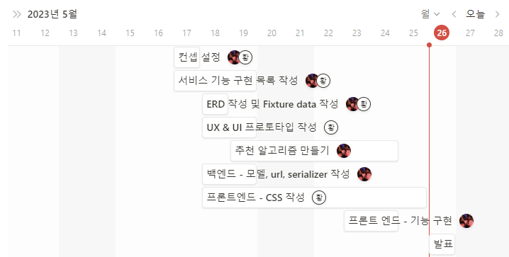
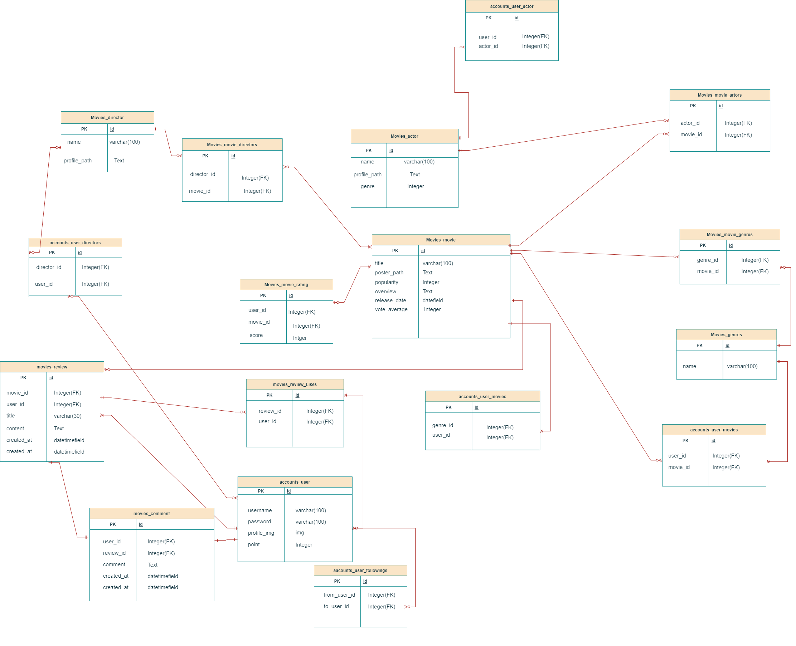
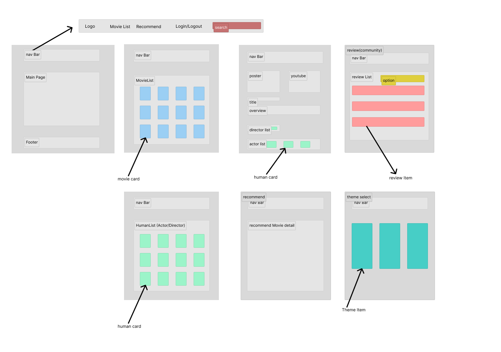

# final_pjt

# 웹사이트 이름:MOVIESCAPE

# Description
### <방탈출 컨셉의 영화 추천 웹사이트>
단서를 찾아 방을 탈출하는 방탈출처럼 웹사이트에서 취향에 맞는 영화를 추천받아
지루한 일상을 탈출하기를 바라는 마음에서 만들었습니다.

# 목표서비스 구현 및 실제구현정도
90%
목표서비스: 

## 팀원 : <손임현, 황수아>

# 팀원정보 및 역할분담

## 손임현(팀장)
  -백엔드 시스템 담당
  협업도구 및 컨벤션 담당
  데이터 베이스 설계
  추천 알고리즘 설계
  API
  -기획 및 디자인
  컨셉 설계
  기술 스택조사
  피그마를 이용한 기본 UI설계

## 황수아  
  -프론트엔드 담당
  일정관리
  프론트엔드 초기설정
  페이지레이아웃 설계
  세부기능
  
  -기획 및 디자인
  컨셉 디자인
  레퍼런스 수집

# 전체 일정

# 기능

알고리즘을 활용한 영화 추천
-유저가 좋아요한 영화 줄거리나 키워드의 유사도를 판별하여 비슷한 영화를 추천
-유저가 좋아요한 배우나 감독이 출연한 영화를 바탕으로 추천

전체 리뷰와 상세 리뷰페이지 구성
전체리뷰: 커뮤니티에서 
 
상세리뷰: MovieDetail을 볼 수 있는 페이지에서 리뷰를 작성하고 다른 사람들이 작성한 리뷰를 볼 수 있도록 함

전체 리뷰: 특정 영화를 선택해서  커뮤니티 페이지에 영화에 대한 후기뿐 아니라 자유로운 주제로 게시글을 올릴 수 있도록 함

(현재 2023.05.22기준)

[완료]

-컨셉설정
-서비스 기능 구현 목록 작성
-ERD 작성 및 FIxture data 작성
-UX&UI 프로토타입 작성(수기)

[수정중]
-프론트엔드 제작
-백엔드 모델,url,serializer작성

[미완료]
-추천알고리즘 만들기

--------------------------------------
(현재  2023.05.25기준)

[전체 완료]

-컨셉설정
-서비스 기능 구현 목록 작성
-ERD 작성 및 FIxture data 작성
-UX&UI 프로토타입 작성(수기)
-프론트엔드 제작
-백엔드 모델,url,serializer작성
-추천알고리즘 만들기

# 화면구성

<라우터>

### Home
HomeView 

### Movie
MovieDetailView 
MovieListView 
GenreListView 

### Human
HumanListView 
ActorDetailView 
DirectorDetailView

### Review
ReviewListView 
CreateReviewView 
ReviewDetailView 

### Recommend
RecommendView

### Account
LoginView 
SignUpView
UserDetailView 
MyDetailView

# 프론트엔드 기능 체크리스트

## 영화 목록 페이지 (MovieListView):
영화 목록을 조회하여 표시
각 영화에 대한 기본 정보 (제목, 포스터 이미지 등) 표시
영화를 클릭하면 해당 영화의 상세 페이지로 이동 (MovieDetail)

## 영화 상세 페이지 (MovieDetail):
선택한 영화의 상세 정보 표시 (제목, 포스터 이미지, 개봉일, 줄거리 등)
영화에 대한 리뷰 작성 기능 제공
다른 사람들이 작성한 리뷰 목록 표시
영화 추천 페이지 

## 영화 추천 페이지 (Recommendation):
유저의 선호도를 바탕으로 알고리즘을 활용해 유사한 영화 추천
유저가 좋아요한 영화의 줄거리나 키워드를 분석하여 유사한 영화를 추천
유저가 좋아하는 배우나 감독이 출연한 영화를 추천

## 커뮤니티(ReviewListView):
커뮤니티 형식으로 영화에 대한 후기 및 자유로운 주제의 게시글 작성 기능 제공
다른 사용자들이 작성한 리뷰 목록 표시
특정 영화를 선택하여 해당 영화에 대한 리뷰를 작성가능

## 출연진 목록 페이지 (ActorListView):
영화에 출연한 배우와 감독 목록 표시
각 배우를 클릭하면 해당 배우의 상세 정보 페이지로 이동
배우에 하트를 눌러 추후 해당 배우가 출연한 영화를 추천 받을 수 있음.

# ERD

# UX/UI Figma

# 서비스 대표기능

## 영화 검색기능
영화를 검색하면 프로필과 포스터가 자동완성으로 
출력된다. 출력된 영화 중 하나를 클릭하면
영화Detailview로 갈 수 있다.

## 프로필 뽑기 기능
단어를 검색하면 그 단어에 맞는
사진이 나오게 되고 그 사진을
프로필로 설정가능

## 인피니티 스크롤
무한하게 스크롤을 내릴 수 있음.

## 장르목록 선택가능
여러가지 장르중 장르를 선택하여 영화를 추천받을 수 있음

## 직관적인 UI
화면 구성이 직관적임.

# 서비스 기능 목록

### 로그인/로그아웃/회원가입

### 유저 팔로우

### 마이페이지 조회

### TMDB 자료 추출 및 DB화

### 영화 메인페이지
-선호하는 장르기반의 영화 추천 

영화 페이지를 출력하기전 유저가 선호장르를 선택할 수 있도록 함.

/범죄/ 스릴러 /공포 /미스터리/

/모험 /판타지/ SF/

/액션/ 서부/ 전쟁/

/가족 /애니메이션/ TV영화/

/역사/다큐멘터리/로맨스/코미디/드라마/

총 18개의 장르중 관심 있는
장르를 선택하면 비슷한 장르의 영화를 추천
-전체-를 선택하여 전체 영화를 출력하게 할 수도 있음.

인피니티 스크롤을 구현하여 마음에 드는 영화를 찾을때까지
끊임없이 스크롤을 내릴 수 있도록 함

### 단일 영화 페이지 조회
 세부 영화 정보표현, 영화 트레일러 영상,
 출연 영화배우와 감독을 볼 수 있으며 영화를 좋아요 하여
 자신의 페이지 목록에 담을 수 있다.
 
 영화에 대한 댓글 목록이 출력되어 다른 사람들이 영화에 대해 
 어떤 평가를 내렸는지 알 수 있다.

 ### 리뷰 생성/삭제
영화에 대한 리뷰를 게시판에 생성하고 삭제

 ### 댓글 생성/삭제
 다른 유저의 리뷰에 댓글을 달 수 있으며 삭제도 가능

 ### 다른 유저의 페이지확인 및 팔로우
 다른 유저가 좋아요한 배우나 영화를 보고 취향을 파악 할 수 있으며
 팔로우하여 친분을 쌓을 수 있음

### 배우& 감독목록
인피니트 스크롤을 구현하여 취향에 맞는 감독과 영화배우를 좋아요 할 수 있도록 함.

### 추천기능
좋아요한 장르와 배우,감독을 통해 유저의 취향에 맞는 영화를 추천.

# 느낀점
